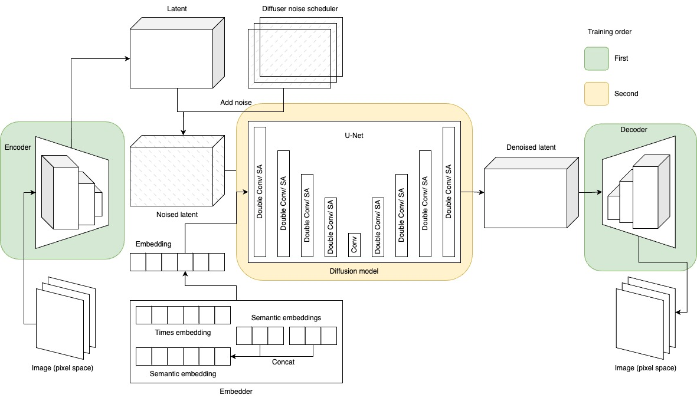

# Light-Weight Image Generation AI Research

## Overview
This repository is dedicated to research on a light-weight image generation AI. The primary goal is to develop a model that can be rapidly trained on a specific dataset for customized purposes, moving away from the heavy architectures that are common in the field.

## Architecture
We have taken inspiration from the stable diffusion architecture of Stability AI. However, we've introduced several customizations:
- A more compressed autoencoder, which results in a lighter architecture.
- A modified U-Net architecture that serves the diffusion purpose, adapted to fit the more compressed nature of our autoencoder.





## Semantic Mapping
It's worth to mention that semantic mapping is not the focus of this research. Instead, we've implemented a simplified version of class embedding using `torch.nn.Embedding` from PyTorch for demonstration purposes.

## Getting Started

### Python Version
The model has been developed and tested on a Linux server running Python 3.8.10. Please ensure that you have a compatible version of Python installed on your system. If you need to install or update Python, you can download it from the [official Python website](https://www.python.org/downloads/).

### Installing Libraries
Once you have the correct Python version installed, you can proceed to install the necessary libraries by running the following command in your terminal or command prompt:
```sh
pip install -r src/requirements.txt
```

### Components
The project is structured into several modules, each serving a distinct purpose in the overall architecture:

#### Dataset Preprocessing
- The initial dataset includes a directory of images and an annotation CSV.
- Preprocessing of this dataset has been completed, and the results can be viewed in [`preprocessing.ipynb`](src/preprocessing.ipynb).

#### Custom PyTorch Dataset Class
- After the preprocessing steps, a customized PyTorch dataset class has been constructed.
- The implementation of this class can be found in the [`entities`](src/entities) directory.

#### Embedding Class
- A simple class embedding has been implemented using PyTorch's `Embedding` module.

#### VAE Module
- This module encompasses the network, trainer class, training customizations, and trigger code.
- The relevant code and details can be found in [`vae_training_app.py`](src/vae_training_app.py).

#### Diffusion Model
- This module includes the components, different variations of U-Net, and the diffuser (trainer).

## Acknowledgements
We would like to express our gratitude to AITIS for providing the original dataset used in this research. Their contribution has been invaluable in advancing our understanding and development of light-weight image generation AI.

